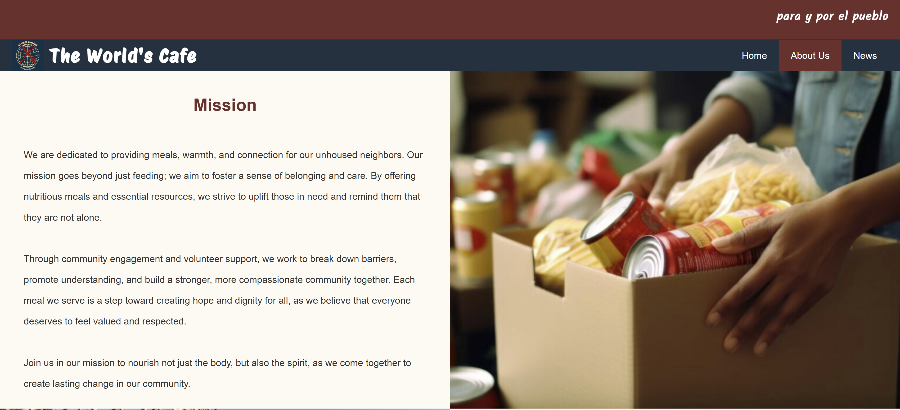

## Cafe Mundial Website

## About the Project
The Cafe Mundial Website is a digital platform built for a newly formed mutual aid organization based in Queens, NYC. The goal of the site is to provide community members with easy access to essential resources, up-to-date information, and upcoming events. The site was designed with accessibility and community engagement in mind, aiming to support local efforts in organizing, sharing resources, and fundraising.

## Built With
-         
-         
- 
- 

## Features 
- **Homepage** with mission statement and contact information
- **About Us** with information about the organization's founding members, mission, and vision
- **News** that pulls live data using an API to show local news relevant to mutual aid efforts in NYC

## Future Improvements 
- **Social Media Integration**: Add Facebook and Twitter links once official accounts are created
- **Donation Functionality**: Incorporate Venmo API or Stripe for secure, real-time donations
- **Multilingual Support**: Add Spanish and Mandarin versions of the site to reflect the diversity of the Queens community

## Screenshots

## Live Demo :rocket:
You can view the deployed website here: 
This site was built using [Cafe Mundial Website on GitHub Pages](https://nicolelucas03.github.io/cafe-mundial-website/)

## Contact 

Nicole Lucas - nicoleclucas003@gmail.com

Project Link: [https://github.com/nicolelucas03/cafe-mundial-website](https://github.com/nicolelucas03/cafe-mundial-website)
